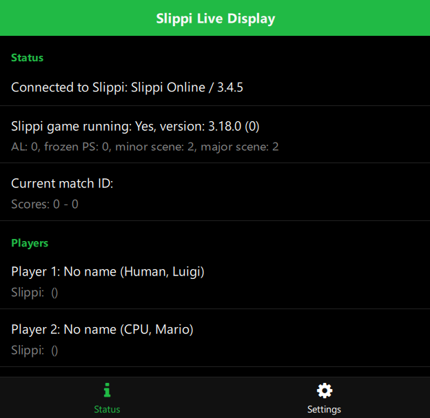
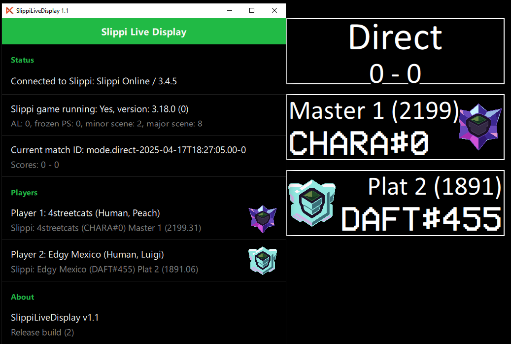
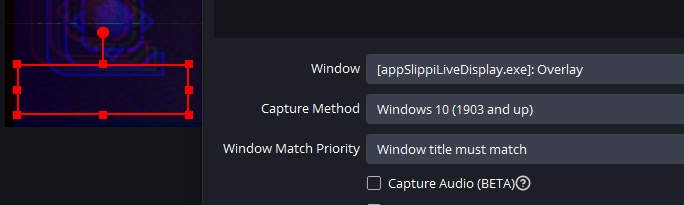
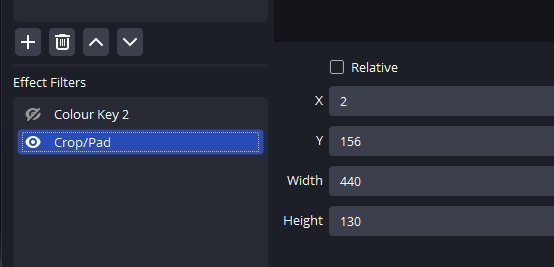

# SlippiLiveDisplay - Automatic Slippi overlay for player codes, ranks and in-game stats

This program can add realtime overlays to your streamed or recorded Slippi gameplay.

# Download

Download the [latest release](https://github.com/cbartsch/SlippiLiveDisplay/releases/latest) for your OS (only Windows for now).

# Contact

Made by me (Chrisu). For feedback, bug reports, feature requests etc. use the issue tracker on this page or contact me via social media:

* Twitter - https://twitter.com/ChrisuSSBMtG
* Support me on Patreon - https://www.patreon.com/chrisu
* DAFT Home Community Discord - https://discord.gg/jKf9XQE

# Credits
* Slippi ([slippi.gg](https://slippi.gg))
* Built with Felgo SDK ([felgo.com](https://felgo.com))

# Table of Contents

* [How to Use](#how-to-use)

# How to Use

Download the latest release for your operating system. Start the included `.app` or the `.exe` file.

The application will automatically connect to a locally running Slippi Dolphin instance.

The window will show connection and game information.

## Overlays

The app adds a transparent overlay window called "Overlay".

The windows contains 3 overlays that will display certain game information.
Each overlay shows a white border to indicate its position.

The overlays, in vertical order, are game information, player 1 and player 2.

During gameplay, they will display information about certain game actions.

When connected to a Slippi online game, they will also display the player connect codes, ranks and game mode (Ranked/Unranked/Direct).

## Capture

You can add the overlays to your streaming or recording software.

For example, you can add a Window Capture in OBS for each of the overlays.

Then add a crop filter to only show that part of the overlay window and position it anywhere on your scene layout.

Each overlay has a size of 440x130 pixels. The x-position is 2 to account for the border. The y-positions are 2, 156 and 310.

